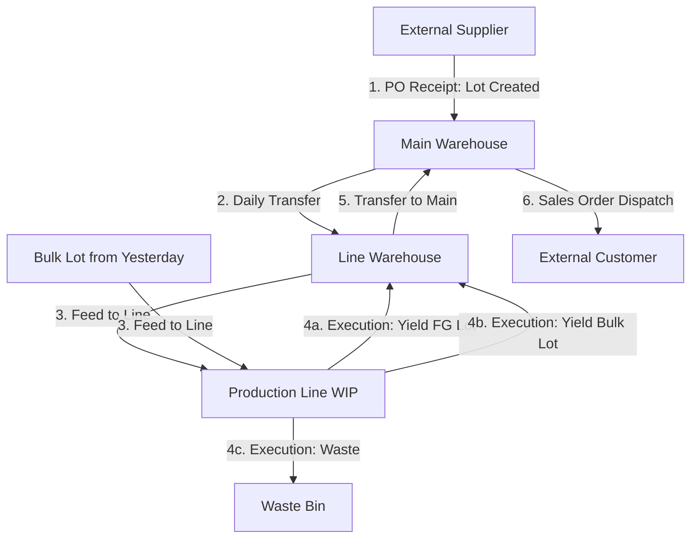

# Manufacturing ERP Traceability & Database Design Blueprint

This document outlines the database design and operational blueprint for a modular, traceability-first manufacturing ERP. It leverages the existing database structures from the Maintenance Work Order (MWO) module and extends them to support receiving, warehousing, production, bulk-handling, waste logging, and shipping.

---

## 1. High-Level Traceability Concept

To achieve **complete backward and forward traceability**, the system relies on a **Lot-Ledger Architecture**. 

- **No Stock Updates in Place**: Standard stock tables that increment/decrement columns in-place are prone to race conditions and destroy historical pathing. Instead, every movement is recorded as a transfer between physical or virtual locations.
- **Lot DAG (Directed Acyclic Graph)**: Every production run (Job) acts as a node that consumes parent lots (raw materials, packaging, bulk) and yields child lots (bulk, finished goods).

### Operational Material Flow


---

## 2. Extended & New Database Schema

The database design expands on the current MWO SQLite schema (and is fully compatible with Postgres scaling). 

### 2.1 Existing MWO Table Alignments & Extensions
We preserve `erp_employees`, `erp_departments`, and `erp_suppliers` while adding typing and categorization to support manufacturing materials.

```sql
-- Extended SKU registry to handle raw materials, bulks, packaging, and maintenance parts
ALTER TABLE erp_skus ADD COLUMN sku_type TEXT NOT NULL CHECK(sku_type IN ('RAW_MATERIAL', 'PACKAGING', 'BULK', 'FINISHED_GOOD', 'MAINTENANCE_PART'));
ALTER TABLE erp_skus ADD COLUMN unit_of_measure TEXT NOT NULL DEFAULT 'UNIT'; -- e.g., 'KG', 'LITERS', 'UNITS', 'ROLLS'
```

### 2.2 Core Manufacturing & Traceability Tables (New)

#### `erp_lots`
The central registry for all material batches. Every physical raw material shipment, bulk tank, or finished good pallet has a unique lot ID.
```sql
CREATE TABLE erp_lots (
    lot_id TEXT PRIMARY KEY,
    sku_id TEXT NOT NULL,
    supplier_lot_number TEXT,              -- Lot code printed on supplier packaging
    parent_production_job_id TEXT,         -- If made internally (BULK or FINISHED_GOOD)
    expiry_date DATE,
    status TEXT NOT NULL CHECK(status IN ('QUARANTINE', 'RELEASED', 'REJECTED', 'HOLD')) DEFAULT 'QUARANTINE',
    created_at TIMESTAMP DEFAULT CURRENT_TIMESTAMP,
    FOREIGN KEY (sku_id) REFERENCES erp_skus(sku_id),
    FOREIGN KEY (parent_production_job_id) REFERENCES production_jobs(job_id)
);
```

#### `production_lines`
Identifies the physical production lines.
```sql
CREATE TABLE production_lines (
    line_id TEXT PRIMARY KEY,
    name TEXT UNIQUE NOT NULL,
    is_active INTEGER DEFAULT 1
);
```

#### `erp_bom` (Bill of Materials)
Defines recipes/packaging configurations.
```sql
CREATE TABLE erp_bom (
    bom_id TEXT PRIMARY KEY,
    parent_sku_id TEXT NOT NULL,           -- The SKU being made (BULK or FINISHED_GOOD)
    component_sku_id TEXT NOT NULL,        -- The SKU consumed (RAW_MATERIAL, PACKAGING, or BULK)
    standard_qty_per_unit REAL NOT NULL,   -- Standard recipe ratio (e.g., 0.05 kg per unit)
    FOREIGN KEY (parent_sku_id) REFERENCES erp_skus(sku_id),
    FOREIGN KEY (component_sku_id) REFERENCES erp_skus(sku_id),
    UNIQUE(parent_sku_id, component_sku_id)
);
```

#### `production_jobs`
Defines production runs per line.
```sql
CREATE TABLE production_jobs (
    job_id TEXT PRIMARY KEY,
    line_id TEXT NOT NULL,
    target_sku_id TEXT NOT NULL,
    target_qty REAL NOT NULL,
    status TEXT NOT NULL CHECK(status IN ('SCHEDULED', 'IN_PROGRESS', 'COMPLETED', 'CANCELLED')) DEFAULT 'SCHEDULED',
    scheduled_date DATE NOT NULL,
    started_at TIMESTAMP,
    completed_at TIMESTAMP,
    operator_id TEXT NOT NULL,
    FOREIGN KEY (line_id) REFERENCES production_lines(line_id),
    FOREIGN KEY (target_sku_id) REFERENCES erp_skus(sku_id),
    FOREIGN KEY (operator_id) REFERENCES erp_employees(id)
);
```

#### `erp_stock_ledger` (Universal Inventory Movements)
Instead of updating inventory quantities in-place, we write ledger entries tracking lot movement between physical/virtual locations. The current balance of any SKU/Lot at any location is the sum of quantities moved in minus quantities moved out.
```sql
CREATE TABLE erp_stock_ledger (
    transaction_id TEXT PRIMARY KEY,
    sku_id TEXT NOT NULL,
    lot_id TEXT NOT NULL,
    from_location_id TEXT NOT NULL,
    to_location_id TEXT NOT NULL,
    quantity REAL NOT NULL CHECK(quantity > 0),
    transaction_type TEXT NOT NULL CHECK(transaction_type IN ('RECEIPT', 'TRANSFER', 'CONSUMPTION', 'PRODUCTION_YIELD', 'SALE', 'WASTE', 'ADJUSTMENT')),
    reference_type TEXT NOT NULL CHECK(reference_type IN ('PO', 'PRODUCTION_JOB', 'SO', 'MWO', 'MANUAL_ADJ')),
    reference_id TEXT NOT NULL,            -- e.g., po_id, job_id, sales_order_id, mwo_id
    performed_by TEXT NOT NULL,
    logged_at TIMESTAMP DEFAULT CURRENT_TIMESTAMP,
    FOREIGN KEY (sku_id) REFERENCES erp_skus(sku_id),
    FOREIGN KEY (lot_id) REFERENCES erp_lots(lot_id),
    FOREIGN KEY (from_location_id) REFERENCES erp_locations(id),
    FOREIGN KEY (to_location_id) REFERENCES erp_locations(id),
    FOREIGN KEY (performed_by) REFERENCES erp_employees(id)
);
```

---

## 3. Location Mapping Matrix
To make inventory updates seamless, physical areas are represented as physical or virtual locations in `erp_locations`.

| Location Name | `id` | Location Type | Description |
|---|---|---|---|
| External Supplier | `LOC-SUPPLIER` | `EXTERNAL` | Virtual source for Purchase Order receipts |
| Main Warehouse | `LOC-MAIN-WH` | `WAREHOUSE` | Primary storage area |
| Line 1 Warehouse | `LOC-L1-WH` | `LINE_WAREHOUSE` | Production Line 1 storage (staging area) |
| Line 1 Production | `LOC-L1-PROD` | `PRODUCTION_LINE` | Active WIP area on Production Line 1 |
| Waste Bins | `LOC-WASTE` | `WASTE` | Bins for scrapped raw materials/packaging |
| Customer Dispatch | `LOC-CUSTOMER` | `EXTERNAL` | Virtual sink for Sales Order delivery |

---

## 4. Traceability Query Scenarios

Here is how the ledger structure resolves trace requests using SQL.

### 4.1 Backward Trace (From Finished Good Lot to Supplier Raw Materials)
Given a finished good lot ID `FG-LOT-999`, find all raw materials, bulks, and supplier lots used to make it.

```sql
WITH RECURSIVE TraceLot(lot_id, parent_job_id, level) AS (
    -- Anchor: Start with target Finished Good Lot
    SELECT lot_id, parent_production_job_id, 0
    FROM erp_lots
    WHERE lot_id = 'FG-LOT-999'
    
    UNION ALL
    
    -- Recursive Step: Trace parent jobs to find lots consumed during their execution
    SELECT 
        l.lot_id,
        l.parent_production_job_id,
        tl.level + 1
    FROM TraceLot tl
    JOIN erp_stock_ledger t ON t.reference_id = tl.parent_job_id
    JOIN erp_lots l ON l.lot_id = t.lot_id
    WHERE t.transaction_type = 'CONSUMPTION'
      AND t.reference_type = 'PRODUCTION_JOB'
)
SELECT 
    tl.level,
    tl.lot_id,
    s.nomenclature AS material_name,
    s.sku_type,
    l.supplier_lot_number,
    sup.name AS supplier_name
FROM TraceLot tl
JOIN erp_lots l ON l.lot_id = tl.lot_id
JOIN erp_skus s ON s.sku_id = l.sku_id
LEFT JOIN erp_suppliers sup ON sup.supplier_id = s.supplier_id;
```

### 4.2 Forward Trace (From Supplier Lot to Customers)
Given a raw material lot ID `RM-LOT-111` recalled by a supplier, identify all finished products made from it and the sales orders that shipped them.

```sql
WITH RECURSIVE TraceForward(lot_id, child_job_id) AS (
    -- Anchor: Start with the recalled raw material lot
    SELECT lot_id, NULL
    FROM erp_lots
    WHERE lot_id = 'RM-LOT-111'
    
    UNION ALL
    
    -- Recursive Step: Find jobs consuming the lot, and match to the lots produced by those jobs
    SELECT 
        l.lot_id,
        j.job_id
    FROM TraceForward tf
    -- Find production jobs that consumed this lot
    JOIN erp_stock_ledger t ON t.lot_id = tf.lot_id AND t.transaction_type = 'CONSUMPTION'
    JOIN production_jobs j ON j.job_id = t.reference_id
    -- Find lots produced by those jobs
    JOIN erp_lots l ON l.parent_production_job_id = j.job_id
)
SELECT 
    tf.lot_id AS affected_lot_id,
    s.nomenclature AS product_name,
    t.reference_id AS sales_order_id,
    t.logged_at AS ship_date
FROM TraceForward tf
JOIN erp_lots l ON l.lot_id = tf.lot_id
JOIN erp_skus s ON s.sku_id = l.sku_id
-- Match to sales shipments
LEFT JOIN erp_stock_ledger t ON t.lot_id = tf.lot_id 
                            AND t.transaction_type = 'SALE'
WHERE s.sku_type = 'FINISHED_GOOD';
```

---

## 5. ERP Module Roadmap

1. **Phase 1: Maintenance Work Order (MWO) [DEPLOYED]**: Manages technicians, equipment assets, and spare parts consumption.
2. **Phase 2: Database Setup & Schema Integration [CURRENT]**: Deploys the shared postgres/sqlite tables for lots, BOMs, and locations.
3. **Phase 3: Logistics & Inventory Flow**: Screens for Receiving (PO reception to Main Whse, assigning internal lot codes) and Transfers (Logistics transferring lot codes to specific Production Line warehouses).
4. **Phase 4: Production & Bulk Execution**: Interfaces for line operators to start production jobs, consume raw material/bulk lots, record production yields (Finished Goods and Bulks), and log waste codes.
5. **Phase 5: Sales, Dispatch & QA**: Covers release workflows (QA status changes on lots) and sales shipment (moving lots from Main Whse to Customer Dispatch).
