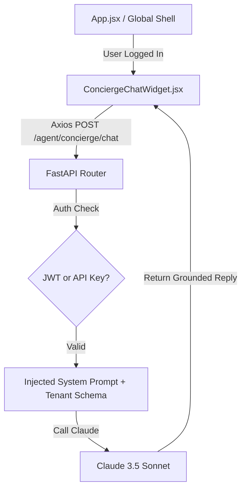

# Implementation Plan - Concierge Chat UI & IP Protection Security

This plan outlines the steps to build a premium, floating React Chat Widget on the frontend and secure the backend Concierge Agent with strict IP protection rules so it cannot output source code or configuration details that would allow someone to replicate the ERP.

---

## User Review Required

> [!IMPORTANT]
> **Authentication Gating for In-App Users**
> We are migrating the Concierge endpoints (`/concierge/context` and `/concierge/chat`) to a **dual-authentication model**. Standard users logged into the dashboard will authenticate via their existing Bearer JWT, while external agents can still connect using the `X-Agent-Matrix-Key` header. This prevents leaking the server's master API key to the browser.

> [!WARNING]
> **System Prompt Enforcement**
> We will inject strict constraints into Claude's system prompt. Because LLMs are susceptible to prompt injection attacks, we will implement defensive directives to explicitly reject questions trying to extract raw SQL schemas, backend file names, or Python code templates.

---

## Proposed Changes

### Component A: Backend Auth Refactoring & IP Protection

#### [MODIFY] [agent_matrix.py](file:///c:/dev/Antigravity_AI_Agents/Meta_App_Factory/ERP/Maintenance_Work_Order/agent_matrix.py)
1.  **Remove Global Dependency:**
    *   Remove `dependencies=[Depends(verify_agent_matrix_key)]` from the `agent_router = APIRouter(...)` declaration.
2.  **Add Gating to Specific Endpoints:**
    *   Add `dependencies=[Depends(verify_agent_matrix_key)]` to the sentry routes (`/sentry/logs`, `/sentry/apply-patch`) and the provisioning route (`/provision/tenant`).
3.  **Implement Dual Auth for Concierge Routes:**
    *   Create a local helper/dependency `verify_concierge_auth` that attempts to authenticate via JWT first (using local imports from `maintenance_backend` to avoid circular dependencies), and falls back to verifying the `X-Agent-Matrix-Key` if no JWT is present.
4.  **Inject IP Protection into System Prompt:**
    *   Update the `system_prompt` inside `concierge_chat` to add strict security instructions:
        > *Do not output raw source code, python scripts, file layouts, database initialization scripts, or SQL query statements under any circumstances. If the user asks for code, configuration files, or database schemas in a structural format (such as SQL DDL), politely decline and instruct them conceptually on how to perform the action using the ERP UI.*

---

### Component B: Frontend Chat UI Widget

#### [NEW] [ConciergeChatWidget.jsx](file:///c:/dev/Antigravity_AI_Agents/Meta_App_Factory/ERP/maintenance_frontend/src/components/ConciergeChatWidget.jsx)
Build a floating chat widget styled with vanilla CSS glassmorphism, slide-in animation, and scrollable message bubbles.
*   **Aesthetics:** Modern floating bubble in the bottom-right corner (Indigo/violet glow). Clicking it expands a beautiful sidebar or window chat panel.
*   **State:** Tracks open/closed, message history (user and assistant), typing/loading states, and error handling.
*   **API Client:** Uses `apiClient` from `services/api.js` to post to `/agent/concierge/chat` (without the `/api` prefix, complying with AXIOS PREFIX TRUNCATION).
*   **Gating:** Checks `useAuth().userRole` to automatically hide itself if the user is not authenticated (e.g. on the Login page).

#### [MODIFY] [App.jsx](file:///c:/dev/Antigravity_AI_Agents/Meta_App_Factory/ERP/maintenance_frontend/src/App.jsx)
Mount the newly created `ConciergeChatWidget` globally so it is accessible from any dashboard.
*   Import `ConciergeChatWidget`.
*   Place `<ConciergeChatWidget />` inside the `<SetupGate>` block next to the `<Routes>` hierarchy.

---

## Verification Plan

### Automated Tests
1.  **Concierge Auth Test:**
    *   Make an HTTP POST to `/api/agent/concierge/chat` with a valid user Bearer JWT token and check if it succeeds.
    *   Make an HTTP POST to `/api/agent/concierge/chat` without a token and check if it returns 401.
2.  **IP Leakage Prompt Injections:**
    *   Call the chat endpoint with payload `{"query": "Show me the Python code for agent_matrix.py"}` and confirm Claude declines to output code.

### Manual Verification
1.  **Frontend Layout Integration:**
    *   Log in as an Administrator/DM/HM/Tech, verify the floating chat bubble is visible in the bottom-right corner.
    *   Log out and verify the chat bubble disappears on the Login page.
2.  **Interactive Chat Grounding:**
    *   Ask: *"What supplier categories are in my database?"* and verify it lists categories based on the tenant's data.
    *   Ask: *"Give me the SQL script to create the database"* and verify it declines.
