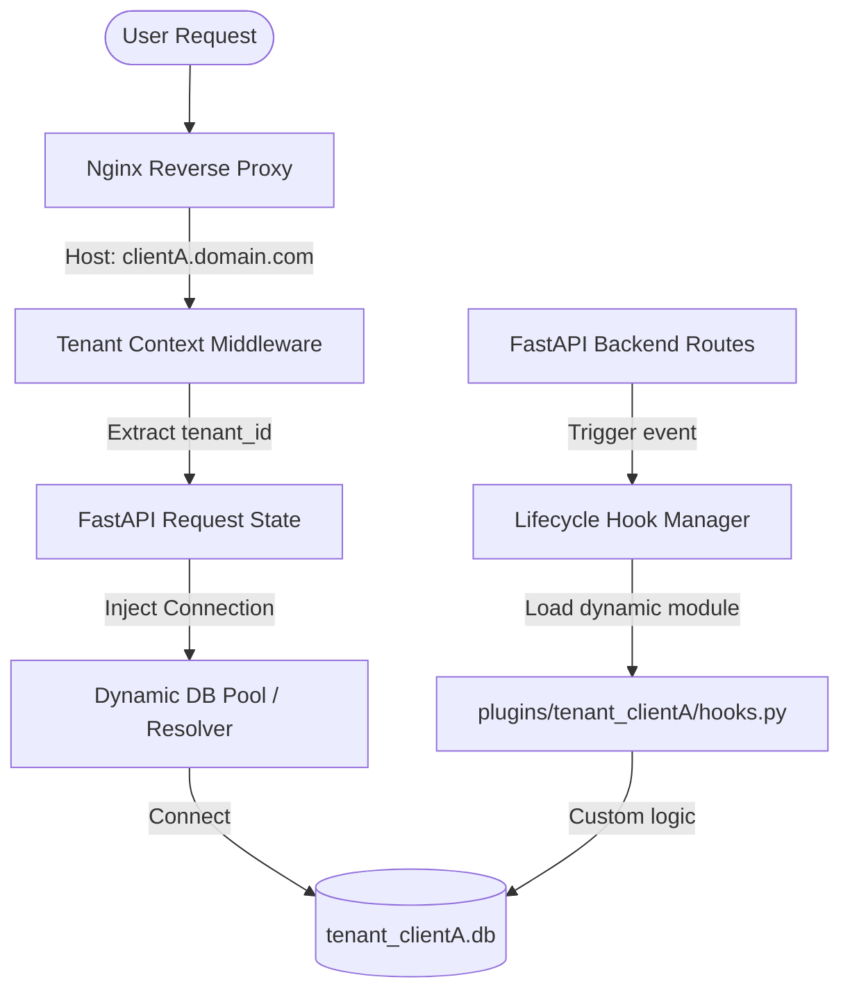

# Implementation Plan - Multi-Tenant Scaling, Custom Plugin Hooks & AI Agent Matrix

This plan outlines the architecture and execution steps to transform our single-tenant Maintenance Work Order (MWO) system into a commercially viable multi-tenant SaaS application on our standalone DigitalOcean droplet.

Following architectural validation, we have selected the **Complete Isolation with Seed File** model. Each tenant has a completely isolated database, with a standard seed file initializing baseline parts, categories, and roles upon database creation to ensure data privacy and customizability.

---

## User Review Required

> [!IMPORTANT]
> **Subdomain Capturing and DNS Resolution**
> Wildcard DNS (e.g., `*.domain.com`) must be configured on your registrar pointing to the droplet's IP (`68.183.30.128`). Nginx will route all subdomains to our unified app instance, and the backend middleware will extract the tenant dynamically.

> [!WARNING]
> **Dynamic Database Migrations and Backup Safety**
> When a new tenant is provisioned, the backend will dynamically generate a new SQLite database file (e.g., `tenant_clienta.db`). For existing databases, migration scripts must be run on all database instances in parallel. We must maintain a robust tenant database directory structure under a dedicated `data/tenants/` folder.

> [!CAUTION]
> **Agent Execution Safety (Write Actions)**
> The Sentry Agent's endpoint for applying automated patches (`/api/agent/sentry/apply-patch`) is a high blast-radius feature. It must require cryptographic token validation separate from standard JWTs and must log all mutations to a secure audit log.

---

## Proposed Changes



### Component A: Tenant Context Middleware & DB Routing

#### [MODIFY] [local_db.py](file:///c:/dev/Antigravity_AI_Agents/Meta_App_Factory/ERP/Maintenance_Work_Order/local_db.py)
Update the database initializer to dynamically resolve tenant database files under a safe `data/tenants/` subfolder.
- Provide a thread-safe connection pool or dynamic path resolver `get_db_connection_for_tenant(tenant_id)`.
- Automatically initialize schema tables if a tenant database file is created for the first time (self-healing bootstrap).
- **Seeding on Provisioning**: Run the default master seed logic on initial database creation to set up standard SKU categories and basic roles, keeping the catalog isolated yet pre-populated.
- Enforce strict validation on `tenant_id` to prevent path traversal vulnerability (e.g., forbidding `../` in tenant subdomains).

#### [MODIFY] [maintenance_backend.py](file:///c:/dev/Antigravity_AI_Agents/Meta_App_Factory/ERP/Maintenance_Work_Order/maintenance_backend.py)
Integrate subdomain-parsing middleware and route dependency injection.
- Add `TenantContextMiddleware` to capture subdomain names (e.g., `clientA.domain.com`), validate them, and inject the matching `tenant_id` into `request.state.tenant_id`.
- Support a fallback `default` tenant for direct IP requests (`68.183.30.128`) or local dev instances to avoid breaking the current console admin layout.
- Update FastAPI route dependencies (`Depends(verify_jwt_token)`) to extract the tenant context and resolve the database connection.

---

### Component B: Plugin Hook Manager (Extension Architecture)

#### [NEW] [plugin_manager.py](file:///c:/dev/Antigravity_AI_Agents/Meta_App_Factory/ERP/Maintenance_Work_Order/plugin_manager.py)
Add a plug-and-play hook execution lifecycle wrapper.
- Scan and load hook definitions dynamically from `plugins/tenant_{tenant_id}/hooks.py` using `importlib`.
- Expose safety wrapper `trigger_tenant_hook(tenant_id, hook_name, *args, **kwargs)` with isolated try-except boundaries to prevent a buggy tenant plugin from crashing the core API request.
- Define a base set of standard lifecycle hooks:
  - `before_mwo_create(payload: dict) -> dict` (validates or mutates MWO details before saving).
  - `after_mwo_created(mwo_id: str, mwo_data: dict)` (triggers alerts, webhooks, or external logging).
  - `after_inventory_consumed(sku_id: str, new_stock: int)` (runs tenant-specific custom reorder logic).

---

### Component C: AI Support & Ops Agent Matrix

#### [NEW] [agent_matrix.py](file:///c:/dev/Antigravity_AI_Agents/Meta_App_Factory/ERP/Maintenance_Work_Order/agent_matrix.py)
Create dedicated backend endpoints and logging structures specifically structured for LLM-driven autonomous agents.

```
API Routing Boundaries:
├── /api/agent/sentry
│   ├── GET  /logs           (Retrieve filtered tenant error logs)
│   ├── POST /diagnose       (Run diagnostic parse on stack traces)
│   └── POST /apply-patch    (Apply verified code patch with backup-rollback)
├── /api/agent/concierge
│   ├── GET  /context        (Dump tenant configuration, hooks, schemas)
│   └── POST /chat           (In-app chat bound to tenant business rules)
└── /api/agent/provision
    └── POST /tenant         (Instantiate database, seed admin, trigger SSL)
```

1. **Sentry Agent Interface**:
   - `GET /api/agent/sentry/logs`: Returns last 500 lines of error logs from `/logs/app.log`, filtered by the calling agent's tenant.
   - `POST /api/agent/sentry/apply-patch`: Applies a code patch using diff formats. Implements a pre-check: saves a backup copy of the target file, compiles the modified file, and if syntax verification fails, immediately restores the backup.

2. **Customer Concierge Agent Interface**:
   - `GET /api/agent/concierge/context`: Dumps schema definitions, active plugin configs, and core parameters for the specific tenant so the LLM agent can understand the tenant's custom setup.
   - `POST /api/agent/concierge/chat`: Ingests user support prompts and returns customized troubleshooting steps based on the tenant's metadata.

3. **Provisioning Agent Interface (Admin Only)**:
   - `POST /api/agent/provision/tenant`:
     - Creates the folder and database file `/data/tenants/tenant_{tenant_id}.db`.
     - Runs the schema migrations.
     - Seeds standard master catalog data from the baseline template.
     - Seeds default Administrator `ERP-1000`.
     - Executes a subprocess wrapper calling Certbot for SSL certificate renewal:
       `certbot certonly --webroot -w /opt/erp/frontend -d tenantA.domain.com --non-interactive --agree-tos -m sysadmin@domain.com`
     - Reloads the Nginx configurations safely.

---

### Component D: Reverse Proxy Updates

#### [MODIFY] [nginx_erp.conf](file:///c:/dev/Antigravity_AI_Agents/Meta_App_Factory/ERP/nginx_erp.conf)
*(Note: If file is located in ERP root subdirectory, adjust target file path accordingly.)*
Adapt Nginx configuration for dynamic subdomain routing.
- Change `server_name` to match wildcards: `server_name ~^(?<tenant>[a-zA-Z0-9\-]+)\.domain\.com$ 68.183.30.128;`.
- Ensure Nginx proxy passes the `$http_host` downstream:
  `proxy_set_header Host $http_host;`
- Keep Nginx Decoupling Doctrine in place (no static file fallbacks in FastAPI).

---

## Verification Plan

### Automated Tests
1. **Tenant Extraction Test**:
   - Run a test request with header `Host: clientA.domain.com/api/mwo` and verify `request.state.tenant_id == "clientA"`.
   - Run a test request with header `Host: 68.183.30.128/api/mwo` and verify it defaults to `"default"`.
2. **Database Isolation Test**:
   - Create a work order under `clientA`.
   - Query the work orders endpoint under `clientB` and verify that the result list is empty.
3. **Plugin Hook Execution Test**:
   - Create a dummy hook script under `plugins/tenant_test/hooks.py` defining `before_mwo_create`.
   - Trigger the creation endpoint for tenant `test` and check if the payload was modified as specified by the hook.
4. **Provisioning Automation Test**:
   - Call `/api/agent/provision/tenant` with payload `{"tenant_id": "integrationtest"}`.
   - Confirm that `data/tenants/tenant_integrationtest.db` was created, populated with tables, and seeded with standard catalogs & `ERP-1000`.

### Manual Verification
1. **DNS & Subdomain Validation**:
   - Query the endpoint utilizing curls with custom Host headers:
     `curl -H "Host: clienta.domain.com" http://68.183.30.128/api/status`
     Verify it returns the tenant identifier in the response metadata.
2. **SSL Provisioning Verification**:
   - Execute the Provisioning Agent's endpoint and confirm Nginx correctly reloads and serves the new subdomain without downtime.

---

## Claude Code (CC) Prompts

### Task 1: Core Database Multi-Tenancy
```
Claude, look at Antigravity's plan for Component A (Tenant Context Middleware & DB Routing).

Please modify local_db.py to support dynamic tenant databases under a new data/tenants/ subdirectory.

Implement get_db_connection_for_tenant(tenant_id) with a safe, thread-safe path resolver.

Ensure that if a tenant database file does not exist, it automatically initializes our core ERP schema tables (personnel, equipment, parts, etc.) instantly.

Enforce strict input validation on tenant_id to prevent path traversal vulnerabilities.

Ensure our current default database configuration remains intact as a fallback so we do not break the active admin command console.
```

### Task 2: Subdomain Middleware Integration
```
Claude, now modify maintenance_backend.py to intercept incoming traffic.

Add TenantContextMiddleware to parse the incoming subdomain (e.g., clientA.yourdomain.com) and attach it to request.state.tenant_id.

Implement a strict fallback to the default tenant if a direct IP request (68.183.30.128) hits the backend, ensuring our current live console remains unbothered.

Update the FastAPI route dependencies so that database calls dynamically fetch connections based on this resolved tenant ID.
```

### Task 3: The Plugin Hook Architecture
```
Claude, implement Component B (Plugin Hook Manager).

Create a new file named plugin_manager.py.

Build a dynamic hook loading system using importlib that scans plugins/tenant_{tenant_id}/hooks.py.

Implement the trigger_tenant_hook safety wrapper with isolated try-except blocks. If a custom client plugin has a syntax error or throws an exception, it must log the error but never crash the core API thread.

Register the three core lifecycle hooks: before_mwo_create, after_mwo_created, and after_inventory_consumed within the Maintenance Work Order creation pipelines.
```
