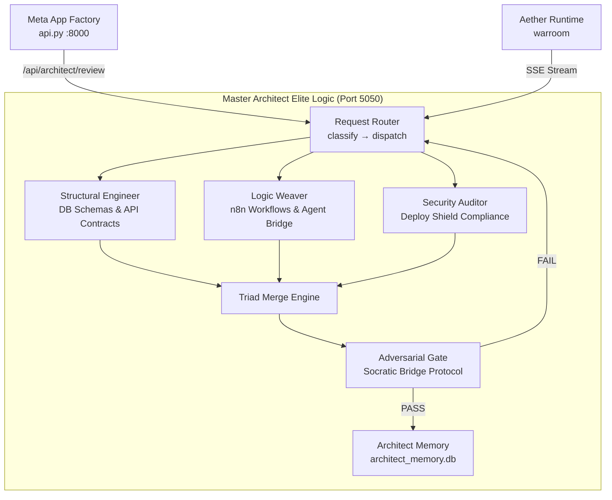

# Master Architect Elite Logic — Technical Specification
## Meta App Factory Ingestion File | Port 5050

---

> **Project**: Master_Architect_Elite_Logic  
> **Version**: 1.0.0  
> **Status**: Standalone Multi-Agent App  
> **Port**: 5050 (Backend), 5175 (Frontend Dev)  
> **Generated**: 2026-03-26  

---

## 1. Executive Summary

The Master Architect is being migrated from a single-script Rule 0 engine (`proactive_architect.py`) embedded in `Project_Aether/` to a **standalone multi-agent application** running on Port 5050. The new app introduces a **Triad Architecture** — three specialized internal agents orchestrated by a central runtime — plus an **Adversarial Gate** powered by the Socratic Bridge protocol that stress-tests every architecture before finalization.

---

## 2. The Triad — Internal Agent Architecture



### 2.1 Structural Engineer

**Domain**: Database schemas, API contracts, data models, migration paths.

| Responsibility | Implementation |
|---|---|
| Schema validation | Validates Pydantic models, SQLite/Postgres schemas |
| API contract review | Checks REST endpoint consistency (method, auth, validation) |
| Migration planning | Generates upgrade paths from current → proposed state |
| Port conflict detection | Cross-references `registry.json` port assignments |

**System Prompt Core**:
```
You are the Structural Engineer of the Master Architect Triad.
Your domain: database schemas, API contracts, data models, and system structure.
Analyze the proposed change and output ONLY a JSON verdict:
{
  "domain": "structural",
  "score": <0-100>,
  "schemas_reviewed": [...],
  "api_contracts": [...],
  "migration_required": true/false,
  "port_conflicts": [],
  "concerns": [...],
  "recommendations": [...]
}
```

### 2.2 Logic Weaver

**Domain**: n8n workflow integration, Gemini Agent Bridge routing, inter-agent communication patterns.

| Responsibility | Implementation |
|---|---|
| n8n workflow audit | Validates webhook URLs, node chains, credential references |
| Agent Bridge routing | Reviews Aether C-Suite dispatch patterns |
| Circuit breaker analysis | Checks fallback chains (n8n → Gemini → cached) |
| Workflow dependency mapping | Maps trigger→action→output flows |

**System Prompt Core**:
```
You are the Logic Weaver of the Master Architect Triad.
Your domain: n8n workflows, agent routing, inter-service communication.
Analyze the proposed change and output ONLY a JSON verdict:
{
  "domain": "logic",
  "score": <0-100>,
  "workflow_impacts": [...],
  "agent_routing_changes": [...],
  "fallback_chain_valid": true/false,
  "circuit_breaker_status": "ok|warn|fail",
  "concerns": [...],
  "recommendations": [...]
}
```

### 2.3 Security Auditor

**Domain**: Deploy Shield compliance, vault access patterns, PII exposure, credential rotation.

| Responsibility | Implementation |
|---|---|
| Credential audit | Scans for hardcoded secrets, validates vault usage |
| PII detection | Regex + AI scan for exposed personal data |
| CORS/auth review | Validates origin whitelist, auth middleware |
| Dependency CVE check | Cross-references package versions against known CVEs |
| Deploy Shield gate | Final compliance check before any deployment |

**System Prompt Core**:
```
You are the Security Auditor of the Master Architect Triad.
Your domain: security compliance, credential management, PII protection.
Analyze the proposed change and output ONLY a JSON verdict:
{
  "domain": "security",
  "score": <0-100>,
  "credential_exposure": [],
  "pii_risks": [],
  "cors_valid": true/false,
  "deploy_shield_status": "PASS|WARN|FAIL",
  "concerns": [...],
  "recommendations": [...]
}
```

---

## 3. Adversarial Gate — Socratic Bridge Protocol

Before any architecture is finalized, it passes through the **Adversarial Gate**, which adapts the existing `SocraticChallenger` logic (from `socratic_challenger.py`) into an architecture-specific stress test.

### 3.1 Gate Flow

```
[Triad Merged Verdict] → Adversarial Gate
  ├── IF composite_score >= 85 → AUTO-APPROVE → Store in Memory
  ├── IF composite_score 60-84 → SOCRATIC CHALLENGE (3 weakness probes)
  │     ├── User provides reasoning → analyze_response()
  │     ├── CONVINCED → Store in Memory with "Battle-Tested" tag
  │     └── UNCONVINCED → Return to Triad with weakness context
  └── IF composite_score < 60 → REJECT with detailed report
```

### 3.2 Architecture-Specific Weakness Categories

Extends the base `WEAKNESS_CATEGORIES` with architecture-focused probes:

- **Single Point of Failure**: No redundancy in the data path
- **Horizontal Scaling Barrier**: Architecture prevents adding more instances
- **State Coupling**: Shared mutable state between services
- **Schema Migration Risk**: Breaking changes without rollback path
- **Credential Surface Area**: Too many services with direct secret access
- **Observability Gap**: No telemetry/logging for failure reconstruction

---

## 4. Architect Memory — `architect_memory.db`

SQLite database storing validated architecture patterns for future reference.

### 4.1 Schema

```sql
-- Winning architecture patterns
CREATE TABLE patterns (
    id          INTEGER PRIMARY KEY AUTOINCREMENT,
    pattern_hash TEXT UNIQUE NOT NULL,        -- SHA256 of normalized pattern
    domain      TEXT NOT NULL,                -- structural|logic|security
    category    TEXT NOT NULL,                -- api|dashboard|pipeline|agent|...
    pattern     TEXT NOT NULL,                -- Pattern name
    rationale   TEXT,                         -- Why this pattern was chosen
    technologies TEXT,                        -- JSON array
    triad_score INTEGER,                     -- Composite Triad score (0-100)
    gate_status TEXT DEFAULT 'approved',      -- approved|battle_tested|commander_override
    use_count   INTEGER DEFAULT 1,           -- Times this pattern was recommended
    created_at  TIMESTAMP DEFAULT CURRENT_TIMESTAMP,
    last_used   TIMESTAMP DEFAULT CURRENT_TIMESTAMP
);

-- Architecture review log
CREATE TABLE reviews (
    id              INTEGER PRIMARY KEY AUTOINCREMENT,
    request_hash    TEXT NOT NULL,
    request_summary TEXT NOT NULL,
    structural_score INTEGER,
    logic_score      INTEGER,
    security_score   INTEGER,
    composite_score  INTEGER,
    verdict         TEXT NOT NULL,             -- APPROVE|CHALLENGE|REJECT
    gate_result     TEXT,                      -- AUTO_APPROVE|CONVINCED|OVERRIDE|REJECTED
    weaknesses      TEXT,                      -- JSON array (from Socratic Gate)
    user_reasoning  TEXT,                      -- Commander's defense (if challenged)
    reviewed_at     TIMESTAMP DEFAULT CURRENT_TIMESTAMP
);

-- Leitner regression trackers  
CREATE TABLE regressions (
    id              INTEGER PRIMARY KEY AUTOINCREMENT,
    pattern_id      INTEGER REFERENCES patterns(id),
    app_name        TEXT NOT NULL,
    file_path       TEXT NOT NULL,
    match_type      TEXT NOT NULL,             -- regression_pattern|keyword_match
    severity        TEXT NOT NULL,             -- HIGH|MEDIUM|LOW
    resolved        BOOLEAN DEFAULT FALSE,
    detected_at     TIMESTAMP DEFAULT CURRENT_TIMESTAMP,
    resolved_at     TIMESTAMP
);
```

### 4.2 Pattern Learning Loop

1. Every **approved** architecture gets stored as a pattern
2. **Battle-tested** patterns (survived Socratic Challenge) get a priority boost
3. Future reviews query `patterns` for similar past decisions (cosine similarity on category + technologies)
4. The `use_count` auto-increments on each re-recommendation
5. `regressions` feeds into the Leitner spaced-repetition system for high-complexity warnings

---

## 5. Folder Structure

```
Master_Architect_Elite_Logic/
├── TECHNICAL_SPEC.md           ← This file (ingestion specification)
├── config.json                 ← App configuration (port, model, thresholds)
├── README.md                   ← App documentation
│
├── server.py                   ← FastAPI backend on Port 5050
├── architect_stream.py         ← SSE streaming bridge for Gemini
├── triad_engine.py             ← Triad orchestration (route → dispatch → merge)
├── agents/
│   ├── structural_engineer.py  ← DB schema & API contract agent
│   ├── logic_weaver.py         ← n8n workflow & agent bridge agent
│   └── security_auditor.py     ← Deploy Shield compliance agent
│
├── adversarial_gate.py         ← Socratic Bridge stress-test protocol
├── memory_engine.py            ← architect_memory.db CRUD operations
├── architect_memory.db         ← SQLite pattern + review storage
│
├── Launch_Master_Architect.bat ← Windows launcher (Google Drive aware)
├── requirements.txt            ← Python dependencies
│
└── architect_ui/               ← Frontend (optional, Phase 2)
    ├── package.json
    ├── index.html
    └── src/
        ├── App.jsx
        └── main.jsx
```

---

## 6. Core Engines — File Specifications

### 6.1 `server.py` — FastAPI Backend (Port 5050)

| Endpoint | Method | Purpose |
|---|---|---|
| `/` | GET | Service info |
| `/api/health` | GET | Health check + memory stats |
| `/api/review` | POST | Full Triad review (blocks until verdict) |
| `/api/review/stream` | POST | SSE streaming Triad review |
| `/api/review/quick` | POST | Single-agent fast review (structural only) |
| `/api/gate/status` | GET | Active Socratic challenges |
| `/api/gate/respond` | POST | Submit reasoning for a challenge |
| `/api/gate/override` | POST | Commander Hard Override |
| `/api/patterns` | GET | Query winning patterns |
| `/api/patterns/similar` | POST | Find similar past patterns |
| `/api/regressions` | GET | Active regression warnings |
| `/api/audit/flow` | POST | Trigger FlowAuditor system scan |
| `/api/audit/leitner` | POST | Trigger Leitner deep review |

### 6.2 `triad_engine.py` — Orchestration

```python
class TriadEngine:
    """
    Routes a review request to all three agents in parallel,
    collects their verdicts, and merges into a composite score.
    """
    
    WEIGHTS = {
        "structural": 0.40,   # Heaviest — bad schemas are hardest to fix
        "logic": 0.30,        # Workflow breakage is next
        "security": 0.30,     # Security is non-negotiable but often fixable
    }

    def review(self, request: ReviewRequest) -> TriadVerdict:
        """Run all three agents, merge scores, pass to Adversarial Gate."""
        ...

    def _classify_request(self, description: str) -> list[str]:
        """Determine which agents need emphasized input."""
        ...
```

### 6.3 `adversarial_gate.py` — Socratic Bridge

Inherits the challenge/convince/override flow from `SocraticChallenger`, but tuned for architecture reviews:

- **Threshold**: 85 (vs. 9.5/10 in War Room — mapped to 0-100 scale)
- **Weakness Generation**: Uses architecture-specific probes, not market/business
- **Memory Integration**: Stores winning arguments in `architect_memory.db`

### 6.4 `memory_engine.py` — Architect Memory

```python
class ArchitectMemory:
    """CRUD interface for architect_memory.db"""
    
    def store_pattern(self, pattern: dict, gate_status: str) -> int: ...
    def find_similar(self, category: str, technologies: list) -> list: ...
    def record_review(self, review: dict) -> int: ...
    def record_regression(self, regression: dict) -> int: ...
    def get_stats(self) -> dict: ...
```

---

## 7. Integration Points

### 7.1 Meta App Factory (`api.py`)

The existing `/api/architect/review` endpoint in `api.py` will be updated to proxy requests to Port 5050 instead of calling `_architect_review()` inline.

```python
# api.py — Updated integration
import httpx

async def _architect_review_v2(feature_description, change_type, affected_components):
    """Proxy to Master Architect Elite Logic on port 5050."""
    try:
        async with httpx.AsyncClient(timeout=30) as client:
            resp = await client.post("http://localhost:5050/api/review", json={
                "description": feature_description,
                "change_type": change_type,
                "components": affected_components,
            })
            return resp.json()
    except Exception:
        # Fallback to inline review
        return _architect_review(feature_description, change_type, affected_components)
```

### 7.2 Aether War Room

The War Room WebSocket messages tagged `[ARCHITECT]` will be forwarded to Port 5050's `/api/review/stream` for real-time SSE Triad analysis.

### 7.3 Phantom QA Gate

The `phantom_gate.py` Stage 2 (Architecture Audit) will optionally call Port 5050 for a deeper Triad review instead of the static `FlowAuditor` alone.

### 7.4 Registry

Add to `registry.json`:
```json
{
  "Master_Architect_Elite_Logic": {
    "status": "active",
    "type": "Architecture Intelligence",
    "port": 5050,
    "capabilities": ["triad_review", "adversarial_gate", "pattern_memory", "regression_scan"],
    "last_build": "2026-03-26T22:00:00Z"
  }
}
```

---

## 8. Configuration — `config.json`

```json
{
  "app_name": "Master_Architect_Elite_Logic",
  "version": "1.0.0",
  "port": 5050,
  "frontend_port": 5175,
  "model": "gemini-2.5-flash",
  "triad_weights": {
    "structural": 0.40,
    "logic": 0.30,
    "security": 0.30
  },
  "adversarial_gate": {
    "auto_approve_threshold": 85,
    "challenge_threshold": 60,
    "max_challenge_rounds": 3
  },
  "memory": {
    "db_path": "architect_memory.db",
    "max_patterns": 500,
    "similarity_threshold": 0.7
  },
  "integrations": {
    "factory_api": "http://localhost:8000",
    "aether_ws": "ws://localhost:8000/ws/warroom",
    "n8n_base": "https://humanresource.app.n8n.cloud"
  }
}
```

---

## 9. Port 5050 Requirements

| Requirement | Detail |
|---|---|
| **Port** | 5050 (backend), auto-fallback to 5051 if occupied |
| **CORS** | Allow origins: `localhost:5173-5180`, `localhost:8000` |
| **Auth** | Same vault-based API key validation as Factory |
| **Startup** | Auto-registered in `registry.json` on first boot |
| **Shutdown** | Graceful — flushes pending reviews to memory DB |
| **Health** | `/api/health` returns Triad status + memory stats |
| **V3 Integration** | Standard `bootstrap_env.bat` + resilience hooks |

---

## 10. Dependencies — `requirements.txt`

```
fastapi>=0.110.0
uvicorn>=0.27.0
pydantic>=2.0
httpx>=0.27.0
python-dotenv>=1.0.0
google-generativeai>=0.8.0
requests>=2.31.0
```

---

## 11. Launch Script — `Launch_Master_Architect.bat`

Follows the same pattern as `Launch_Meta_App_Factory_V3.bat`:
- Auto-detect Google Drive path
- Call `bootstrap_env.bat`
- Start `server.py` on port 5050
- Register in Factory `registry.json`

---

*End of Technical Specification*
