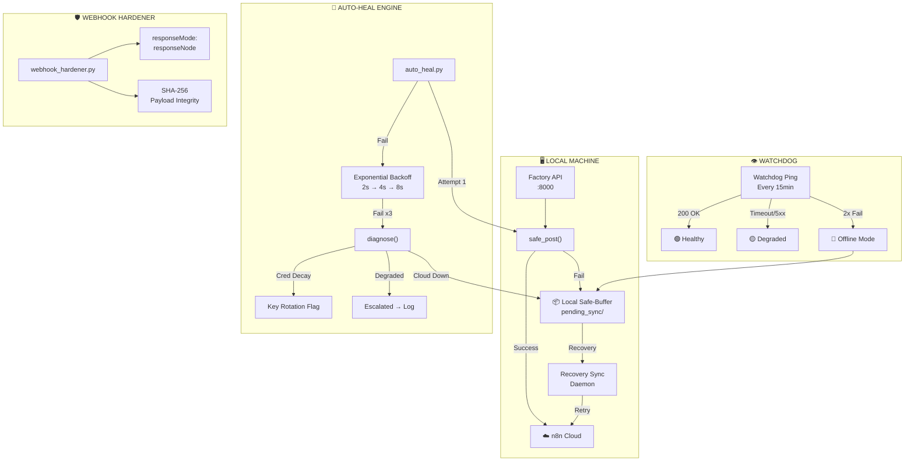

# CTO Resilience Manual — Meta App Factory V3.2
### System Architecture & Self-Healing Infrastructure
**Classification:** Internal Technical Reference | **Version:** V3.2 | **Date:** March 22, 2026
**Author:** CTO — Antigravity-AI | **Audience:** Technical Partners, Engineering Leadership

---

## Executive Summary

Meta App Factory V3.2 operates a 14-agent AI fleet (including the autonomous Phantom QA Agent) across local (FastAPI + Gemini/Claude/o3-mini) and cloud (n8n) infrastructure. The **V3.2 Resilience Stack** ensures zero-downtime operation through a 6-layer defense system: Watchdog monitoring, Local Safe-Buffer, Auto-Heal self-repair, Webhook Hardening, Circuit Breaker, and **Phantom QA Gate** — autonomous regression testing that validates every deployment.

This manual documents the complete resilience architecture for CTO-level technical validation.

---

## V3 Resilience Stack — Architecture



---

## Layer 1: Watchdog — Cloud Health Monitor

The Watchdog pings n8n cloud at configurable intervals to detect outages before they impact operations.

| Parameter | Value | Source |
|-----------|-------|--------|
| Ping URL | `https://humanresource.app.n8n.cloud/webhook/system-watchdog-ping` | `resilience_config.json` |
| Timeout | 5,000ms | `cloud_health.timeout_ms` |
| Check Interval | 900s (15 min) | `cloud_health.check_interval_seconds` |
| Failures for Offline | 2 consecutive | `cloud_health.consecutive_failures_for_offline` |

**Status Codes:**
- 🟢 **GREEN** — Response < 1000ms, HTTP 200
- 🟡 **YELLOW** — HTTP 200 but latency > 1000ms (degraded)
- 🔴 **RED** — Timeout or non-200 → triggers Safe-Buffer mode

---

## Layer 2: Local Safe-Buffer — n8n Statelessness Solution

**The Core Problem:** n8n cloud workflows are stateless. If a webhook call fails, the data is lost forever.

**The Solution:** Every outbound POST to n8n passes through `safe_post()` in `factory.py`. On failure, payloads are serialized to `pending_sync/` as timestamped JSON files.

| Parameter | Value |
|-----------|-------|
| Buffer Directory | `pending_sync/` |
| Latency Threshold | 3,000ms |
| Max Queue Size | 50 MB |
| Retry Interval | 60s |
| Max Retries | 10 |
| Flush on Recovery | `true` |

**Recovery Sync Daemon:** When Watchdog detects cloud recovery (RED → GREEN), all buffered payloads are replayed in chronological order. Each is verified via SHA-256 checksum before delivery.

---

## Layer 3: Auto-Heal Engine — Active Self-Repair

`auto_heal.py` transforms passive resilience (buffer and retry later) into **active self-repair** (retry now, diagnose root cause, escalate).

### Standard Flow (`healed_post`)
```
Attempt 1 → safe_post()
  ├─ "sent"     → Done ✅
  ├─ "buffered" → Cloud down, buffered for Recovery Sync
  └─ "failed"   → Retry with exponential backoff
       ├─ Retry 1 (2s wait)
       ├─ Retry 2 (4s wait)
       └─ Retry 3 (8s wait)
            └─ All failed → diagnose() → log → "escalated"
```

**Return values:** `sent` | `healed` | `buffered` | `escalated`

### N8N-Specific Throttled Flow (`healed_post_n8n`)
Aggressive backoff to prevent IP rate-limiting on n8n cloud:

| Retry | Wait Time | Cumulative |
|-------|-----------|------------|
| 1 | 30s | 30s |
| 2 | 60s | 1.5 min |
| 3 | 120s | 3.5 min |
| 4 | 240s | 7.5 min |
| 5 | 300s (cap) | 12.5 min |

### Decorator Pattern
```python
@auto_heal(project="WarRoom", max_retries=3)
def _call_n8n_agent_inner(agent_name: str, topic: str) -> str:
    """Any function wrapped with @auto_heal gets automatic
    retry + backoff + diagnosis on failure."""
```

### Diagnostic Verdicts
| Verdict | Meaning | Auto-Action |
|---------|---------|-------------|
| `HEALTHY` | All systems nominal | None |
| `DEGRADED` | Cloud slow but responsive | Monitor |
| `CLOUD_DOWN` | Watchdog RED | Buffer active |
| `CREDENTIAL_DECAY` | API key expired/invalid | Flag for rotation |
| `CREDENTIAL_MISSING` | No API key found | Alert |
| `SAFE_BUFFER_ACTIVE` | Already in buffer mode | Recovery Sync handles |

---

## Layer 4: Webhook Hardener — Timeout Prevention

`webhook_hardener.py` iterates all n8n workflows and updates webhook trigger nodes to use `responseMode: responseNode`, preventing cloud timeouts on heavy LLM executions.

**Additional:** SHA-256 checksum handshake verifies payload integrity on critical financial data (CFO V2 workflow).

```python
def verify_payload_hash(payload: dict, expected_hash: str) -> dict:
    """Cryptographic integrity verification for financial data."""
    computed = compute_payload_hash(payload)
    return {"valid": computed == expected_hash, "action": "accepted" if valid else "autonomous_retry"}
```

---

## Layer 5: Circuit Breaker — Cascading Failure Prevention

| Parameter | Value |
|-----------|-------|
| Failure Threshold | 3 consecutive failures |
| Cooldown | 120s |
| Success Threshold | 2 (to close breaker) |

The circuit breaker prevents cascading failures across the 13-agent fleet. If Agent A triggers 3 consecutive failures, the breaker opens and all calls to that agent's webhook are short-circuited for 120s, allowing the cloud to recover.

---

## Quarantine System

Persistently failing payloads are moved to quarantine after exhausting all retry and buffer options:

| Parameter | Value |
|-----------|-------|
| Enabled | `true` |
| Storage | `data/quarantine.json` |
| Max Items | 200 |
| Repair Agent | `aegis_agent` |

The Aegis Agent periodically reviews quarantined items for manual or automated resolution.

---

## Operational Commands

| Command | Purpose |
|---------|---------|
| `python auto_heal.py` | Run full system diagnosis |
| `python webhook_hardener.py` | Dry-run webhook audit |
| `python webhook_hardener.py --apply` | Apply webhook optimizations |
| `python deploy_watchdog.py` | Deploy/update Watchdog workflow |

---

## Monitoring & Logs

| File | Contents |
|------|----------|
| `auto_heal_log.json` | All heal events (last 500) |
| `webhook_hardener_report.json` | Latest hardener scan results |
| `resilience_config.json` | Hot-configurable resilience parameters |
| `socratic_logs/socratic_audit.json` | Critic challenge & override history |

---

*V3.2 Resilience Stack — designed for zero-downtime AI operations at scale.*

---

## Layer 6: Phantom QA Gate — Autonomous Regression Testing

The Phantom QA Agent is a permanent member of the C-Suite that impersonates user personas and systematically tests all features of any app after every deployment.

| Parameter | Value |
|-----------|-------|
| Engine | `Project_Aether/C-Suite_Active_Logic/Phantom_QA/phantom_agent.py` |
| Trigger | Post-build mandatory, nightly cron, on-demand |
| Reports To | CTO + Compliance Officer |
| Personas | Tim (teen tester), Parent (portal tester), New Student (edge cases) |
| Test Coverage | Health check, SSE chat, file upload, Vision OCR, Mind Map, API endpoints |

**Rule:** No feature is considered "deployed" until Phantom QA signs off with a passing report.

---

## V3.2 Additions — Intelligent Model Router & Vision OCR

### Intelligent Model Router (`model_router_v3.py`)
Dynamic API gateway that routes payloads to the optimal LLM based on task complexity:
- **Standard Chat** → Gemini 2.5 Flash (sub-second latency)
- **Deep Reasoning / Math** → o3-mini or Claude 3.7 Sonnet (zero-hallucination)

### Gemini Vision OCR (`server.py`)
Multimodal image-to-text extraction for homework photo uploads:
- Uses Gemini 2.5 Flash Vision natively (no Tesseract dependency)
- Extracts handwritten equations, printed text, whiteboard content
- Feeds directly into the Socratic Bridge deconstruction pipeline

### Graph Memory Engine (`graph_memory_v3.py`)
Node-edge cognitive memory that maps user learning breakthroughs:
- Replaces flat-file `MASTER_INDEX.md` logging for semantic relationships
- Links concepts across subjects (Math ↔ Physics structural reasoning)
- Future migration target: Neo4j Aura or Mem0

---

*V3.2 Resilience Stack — 6 layers of autonomous defense for zero-downtime AI operations at scale.*
