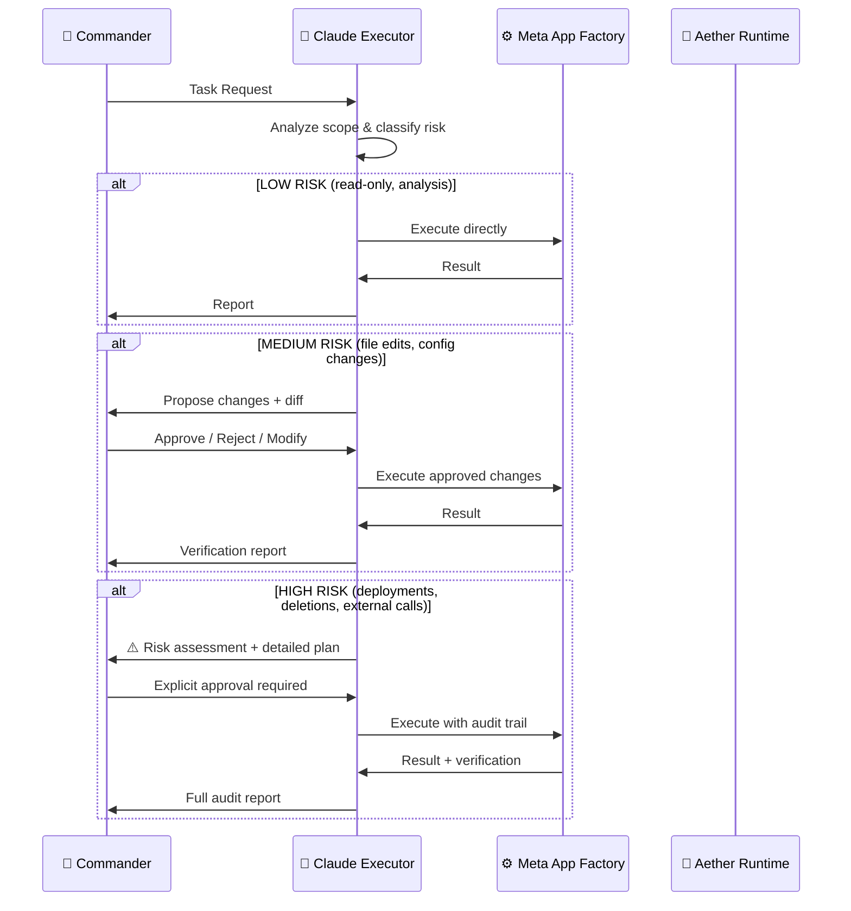

# Claude Executor — HITL Protocol
### Human-in-the-Loop Governance for AI Code Execution
**Classification:** CTO Dev Gate | **Version:** 1.1 | **Date:** March 22, 2026
**Compliance:** Binding Protocol § Pre-Action Audit Required

---

## Purpose

This document defines the **Human-in-the-Loop (HITL) protocol** governing how Claude (Anthropic) operates as the primary code executor within the Antigravity-AI ecosystem. It satisfies CTO oversight concerns by ensuring no autonomous code execution occurs without appropriate human authorization.

---

## The Claude Executor Model



---

## Risk Classification Matrix

| Level | Category | Examples | HITL Gate |
|-------|----------|----------|-----------|
| 🟢 **LOW** | Read-only | File viewing, search, analysis, status checks | Auto-execute |
| 🟡 **MEDIUM** | Stateful | Code edits, config changes, new files | Show diff → await approval |
| 🔴 **HIGH** | Destructive/External | File deletion, deployment, API calls, package installs | Risk assessment + explicit approval |
| ⚫ **CRITICAL** | Security-sensitive | Credential handling, encryption, network config | Multi-step verification |

---

## Pre-Action Audit Requirements

### Before Any Code Execution, Claude Must:

1. **Classify the action** into the risk matrix above
2. **Present the plan** to the Commander before execution
3. **Show exact diffs** for file modifications (not summaries)
4. **Await explicit approval** for MEDIUM+ risk actions
5. **Never auto-run** potentially destructive commands

### The Binding Protocol

The following operations **ALWAYS** require Commander approval, regardless of context:

| Operation | Reason | Approval Type |
|-----------|--------|---------------|
| `run_command` with side effects | System state mutation | Per-command approval |
| File deletion | Irreversible data loss | Explicit confirmation |
| External API calls | Network exposure | Risk assessment |
| Package installation | Supply chain risk | Show package + version |
| Database mutations | Data integrity | Schema review |
| Deployment triggers | Production impact | Full pre-flight check |
| Credential access | Security boundary | Zero auto-access |

---

## Integration with Aether Runtime

### Agent → Claude → Commander Flow

When an Aether agent (e.g., CTO, CMO) needs code execution:

```
1. Agent generates recommendation via n8n webhook
2. Recommendation enters Boardroom_Exchange log
3. Claude receives the recommendation as context
4. Claude classifies the risk and proposes changes
5. Commander approves/rejects
6. Claude executes approved changes only
7. Verification runs automatically
8. **Phantom QA validates the deployment** (mandatory post-execution gate)
9. Results logged to MASTER_INDEX
```

### Socratic Challenger Integration

When the Critic scores a proposal below 9.5/10:
- Challenge is issued with specific weaknesses
- Commander can provide reasoning to convince
- If unconvinced, Commander can Hard Override
- Hard Override is logged with 30-day audit requirement
- **HITL is preserved:** even overrides require Commander action

---

## Operational Safeguards

### What Claude Can Do Autonomously
- ✅ Read files and directories
- ✅ Search codebases (grep, find)
- ✅ Analyze code and provide recommendations
- ✅ View terminal output
- ✅ Read browser pages

### What Claude Needs Approval For
- ⚠️ Create or edit files → diff shown first
- ⚠️ Run terminal commands → command shown first
- ⚠️ Install packages → package + version shown
- ⚠️ Make external requests → URL + payload shown

### What Claude Will Never Do
- 🚫 Auto-delete files without confirmation
- 🚫 Auto-deploy to production
- 🚫 Access credentials without explicit need
- 🚫 Execute commands marked as unsafe
- 🚫 Bypass the Commander's approval chain

---

## Audit Trail

All Claude Executor actions are logged to:

| Log | Contents |
|-----|----------|
| Conversation artifacts | Full interaction history with diffs |
| `MASTER_INDEX.md` | System-level change registry |
| `auto_heal_log.json` | Self-repair events |
| `socratic_logs/socratic_audit.json` | Critic challenges and overrides |
| `Boardroom_Exchange/` | Agent deliberation records |
| `Phantom_QA/reports/` | Automated regression test reports |

---

## Compliance Statement

This HITL protocol ensures:
1. **No autonomous code execution** — Commander always has veto power
2. **Full audit trail** — Every action is logged and reviewable
3. **Risk-proportional gates** — Low-risk actions flow fast, high-risk actions get scrutiny
4. **Agent containment** — AI agents recommend but never execute directly
5. **Override accountability** — Hard Overrides are logged with audit deadlines

---

*Claude Executor HITL Protocol v1.1 — CTO-approved governance for AI-assisted development.*
*Updated: Added Phantom QA Gate as mandatory post-execution validation step.*
