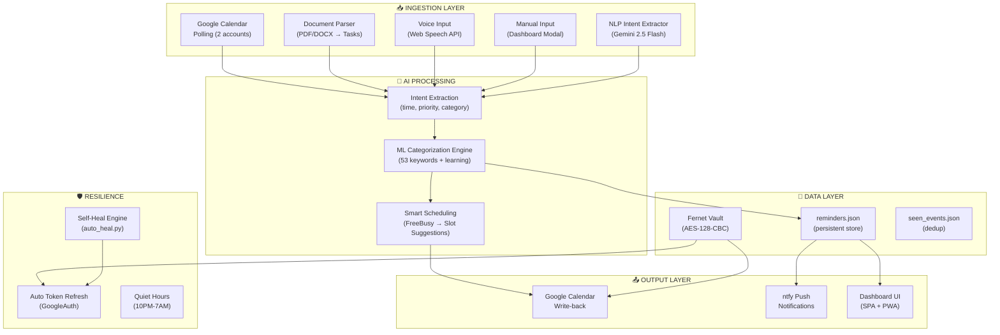

# Sentinel Bridge — CTO Technical Manual
### Architecture, Security & API Reference
**Classification:** Internal Technical Reference | **Version:** 2.0 | **Date:** March 23, 2026
**Author:** CTO — Antigravity-AI | **Audience:** Technical Partners, Engineering Leadership

---

## Executive Summary

Sentinel Bridge is an **AI-native autonomous reminder system** built on FastAPI + Gemini that unifies multi-calendar management, NLP task extraction, ML-powered categorization, and self-healing resilience. Unlike passive task managers (Todoist, Notion, TickTick, Google Tasks), Sentinel actively ingests, categorizes, schedules, and monitors tasks with zero human intervention.

This document covers the full architecture for CTO-level technical validation.

---

## System Architecture

---

## Core Modules

| Module | File | Purpose |
|--------|------|---------|
| **Server** | `sentinel_server.py` | FastAPI app, 20+ REST endpoints, scheduler |
| **Calendar Poller** | `calendar_poller.py` | Google Calendar polling across work + personal accounts |
| **Categorization Engine** | `categorization_engine.py` | ML keyword matching + user override learning |
| **Intent Extractor** | `intent_extractor.py` | NLP time/priority/category extraction via Gemini |
| **Document Parser** | `document_parser.py` | PDF/DOCX → structured task extraction |
| **Notification Dispatcher** | `notification_dispatcher.py` | ntfy.sh push with quiet hours |
| **Fernet Vault** | `fernet_vault.py` | AES-128-CBC encrypted secrets store |
| **Self-Heal Engine** | `self_heal.py` | Exponential backoff, diagnosis, quarantine |
| **Google Auth** | `utils/google_auth.py` | OAuth 2.0 + automatic token refresh |
| **Proactive Architect** | `proactive_architect.py` | System-wide flow audit + architecture advisory |
| **Aether Ingestion** | `aether_ingestion.py` | AI pattern ingestion for task detection |

---

## API Surface (20 Endpoints)

### Task Management
| Method | Endpoint | Description |
|--------|----------|-------------|
| `GET` | `/api/reminders` | List all reminders with filters |
| `POST` | `/api/reminders` | NLP-powered reminder creation |
| `POST` | `/api/tasks` | Manual task creation + calendar sync |
| `POST` | `/api/reminders/{id}/done` | Mark done + calendar delete |
| `POST` | `/api/reminders/{id}/snooze` | Snooze with configurable duration |
| `PUT` | `/api/reminders/{id}/edit` | Edit activity and due date |
| `PUT` | `/api/reminders/{id}/category` | Change category + ML learning |
| `POST` | `/api/reminders/{id}/archive` | Swipe-to-archive |

### Calendar
| Method | Endpoint | Description |
|--------|----------|-------------|
| `GET` | `/api/calendar/accounts` | List configured calendars with auth status |
| `POST` | `/api/calendar/poll` | Force manual calendar poll |
| `GET` | `/api/calendar/events` | Unified events for calendar view |
| `GET` | `/api/calendar/freebusy` | **Smart Scheduling** — free slot suggestions |

### System
| Method | Endpoint | Description |
|--------|----------|-------------|
| `GET` | `/api/telemetry` | Full system health + stats |
| `GET` | `/api/categories` | ML engine stats + category list |
| `GET` | `/api/auth/status` | OAuth status for all accounts |
| `GET` | `/api/auth/google` | OAuth consent flow initiation |
| `GET` | `/api/auth/google/callback` | OAuth code exchange + token storage |
| `POST` | `/api/notifications/test` | Test push notification |
| `POST` | `/api/documents/parse` | Document → task extraction |
| `GET` | `/dashboard` | SPA Dashboard (HTML) |

---

## Security Architecture

### Credential Management
- **Fernet Vault** — AES-128-CBC encryption for all secrets
- Vault path: `%LOCALAPPDATA%\AntigravityAI\Sentinel_Bridge\vault.enc`
- Stores: Google OAuth tokens, refresh tokens, client secrets, ntfy topic
- 8 secrets currently managed

### OAuth 2.0 Flow
- **Access type:** `offline` (enables refresh tokens)
- **Prompt:** `consent` (forces refresh token issuance)
- **Auto-refresh:** `GoogleAuth.get_valid_token()` checks token validity via Google tokeninfo API, auto-refreshes on 401
- **Token rotation:** New access token stored in vault on every refresh
- **Scopes:** `calendar.readonly` + `calendar.events`

### Notification Security
- Push via ntfy.sh over HTTPS
- Topic-based access control
- Quiet hours enforcement (10PM–7AM, bypass for high-priority)

---

## Resilience Stack

| Layer | Component | Purpose |
|-------|-----------|---------|
| 1 | **Self-Heal Engine** | Exponential backoff (2s→4s→8s), auto-diagnosis |
| 2 | **Auto Token Refresh** | GoogleAuth auto-refreshes expired OAuth tokens |
| 3 | **Quiet Hours** | Prevents notification fatigue (10PM–7AM) |
| 4 | **Proactive Architect** | System-wide flow audit, gap detection |
| 5 | **Phantom QA Gate** | Automated UI + API regression testing |

---

## Competitive Technical Advantage

| Capability | Todoist | Notion | TickTick | Google Tasks | **Sentinel** |
|------------|:-------:|:------:|:--------:|:------------:|:------------:|
| AI auto-categorization | ❌ | ❌ | ❌ | ❌ | **✅ ML + learning** |
| Document → Tasks | ❌ | ❌ | ❌ | ❌ | **✅ PDF/DOCX** |
| Multi-calendar write-back | ❌ | ❌ | ⚠️ | ⚠️ | **✅ 2 accounts** |
| Smart Scheduling (FreeBusy) | ❌ | ❌ | ❌ | ❌ | **✅ AI slots** |
| Self-healing architecture | ❌ | ❌ | ❌ | ❌ | **✅ 5-layer** |
| Encrypted vault | ❌ | ❌ | ❌ | ❌ | **✅ Fernet** |
| Auto token refresh | ✅ | ✅ | ✅ | ✅ | **✅ GoogleAuth** |
| NLP intent extraction | ❌ | ❌ | ⚠️ | ⚠️ | **✅ Gemini** |
| Automated regression testing | ❌ | ❌ | ❌ | ❌ | **✅ Phantom QA** |

---

## Deployment

| Parameter | Value |
|-----------|-------|
| Runtime | Python 3.14 + FastAPI + uvicorn |
| Port | 5009 |
| PWA | Service worker + manifest |
| Tunnel | ngrok (optional) |
| Scheduler | APScheduler (15-min calendar poll) |
| AI Engine | Gemini 2.5 Flash (via google-genai SDK) |

---

*Sentinel Bridge V2.0 — AI-native autonomous task management with 5-layer resilience.*
""", "Complexity": 8, "Description": "CTO Technical Manual for Sentinel Bridge covering architecture, API surface, security, and competitive advantages", "EmptyFile": false, "IsArtifact": false, "Overwrite": false}
