# Agent Network Map — 2026-03-11_1551

Generated by Visual Mapping Protocol

## Legend
- 🟢 Active App | ⚪ Inactive App
- 👻 Orphaned Agent (< 2 calls/week)
- 🔥 Bottleneck Agent (> 80th percentile)

## Network Diagram

```mermaid
flowchart TB

    %% === META APP FACTORY AGENT NETWORK ===

    subgraph APPS["📦 MetaApps"]
        Alpha_V2_Genesis["🟢 Alpha_V2_Genesis :5005"]
        Resonance["🟢 Resonance :5006"]
        MetaTestApp["⚪ MetaTestApp"]
        News_Analyzer["⚪ News Analyzer"]
        Project_Aether["🟢 Project_Aether"]
        Delegate_AI_Beta_Agreement_Vault["🟢 Delegate_AI_Beta_Agreement_Vault :5007"]
        Sentinel_Bridge["🟢 Sentinel_Bridge :5009"]
    end

    subgraph AGENTS["🤖 Specialist Agents"]
        CEO["👻 CEO"]
        CFO["👻 CFO"]
        CMO["👻 CMO"]
        CTO["👻 CTO"]
        CX_Strategist["👻 CX_Strategist"]
        Compliance_Officer["👻 Compliance_Officer"]
        Data_Architect["👻 Data_Architect"]
        Deep_Crawler["👻 Deep_Crawler"]
        Graphic_Designer["👻 Graphic_Designer"]
        Presentation_Expert["👻 Presentation_Expert"]
        Researcher["👻 Researcher"]
        The_Critic["👻 The_Critic"]
        The_Librarian["👻 The_Librarian"]
    end

    subgraph INFRA["⚙️ Infrastructure"]
        FactoryAPI["Factory API :8000"]
        SkillsRouter["Agent Skills Router :8001"]
        n8nCloud["n8n Cloud"]
        CommandCenter["Command Center :5010"]
    end

    FactoryAPI --> Alpha_V2_Genesis
    Alpha_V2_Genesis -.->|webhook| n8nCloud
    FactoryAPI --> Resonance
    Resonance -.->|webhook| n8nCloud
    FactoryAPI --> Delegate_AI_Beta_Agreement_Vault
    Delegate_AI_Beta_Agreement_Vault -.->|webhook| n8nCloud
    FactoryAPI --> Sentinel_Bridge

    FactoryAPI --> SkillsRouter
    FactoryAPI --> CommandCenter

    SkillsRouter -.->|rare| CEO
    SkillsRouter -.->|rare| CFO
    SkillsRouter -.->|rare| CMO
    SkillsRouter -.->|rare| CTO
    SkillsRouter -.->|rare| CX_Strategist
    SkillsRouter -.->|rare| Compliance_Officer
    SkillsRouter -.->|rare| Data_Architect
    SkillsRouter -.->|rare| Deep_Crawler
    SkillsRouter -.->|rare| Graphic_Designer
    SkillsRouter -.->|rare| Presentation_Expert
    SkillsRouter -.->|rare| Researcher
    SkillsRouter -.->|rare| The_Critic
    SkillsRouter -.->|rare| The_Librarian

    Sentinel_Bridge -.->|monitor| Alpha_V2_Genesis
    Sentinel_Bridge -.->|monitor| Resonance
    Sentinel_Bridge -.->|monitor| MetaTestApp
    Sentinel_Bridge -.->|monitor| News_Analyzer
    Sentinel_Bridge -.->|monitor| Project_Aether
    Sentinel_Bridge -.->|monitor| Delegate_AI_Beta_Agreement_Vault

    %% Styling
    style CEO stroke:#999,stroke-width:1px,stroke-dasharray: 5 5,color:#999
    style CFO stroke:#999,stroke-width:1px,stroke-dasharray: 5 5,color:#999
    style CMO stroke:#999,stroke-width:1px,stroke-dasharray: 5 5,color:#999
    style CTO stroke:#999,stroke-width:1px,stroke-dasharray: 5 5,color:#999
    style CX_Strategist stroke:#999,stroke-width:1px,stroke-dasharray: 5 5,color:#999
    style Compliance_Officer stroke:#999,stroke-width:1px,stroke-dasharray: 5 5,color:#999
    style Data_Architect stroke:#999,stroke-width:1px,stroke-dasharray: 5 5,color:#999
    style Deep_Crawler stroke:#999,stroke-width:1px,stroke-dasharray: 5 5,color:#999
    style Graphic_Designer stroke:#999,stroke-width:1px,stroke-dasharray: 5 5,color:#999
    style Presentation_Expert stroke:#999,stroke-width:1px,stroke-dasharray: 5 5,color:#999
    style Researcher stroke:#999,stroke-width:1px,stroke-dasharray: 5 5,color:#999
    style The_Critic stroke:#999,stroke-width:1px,stroke-dasharray: 5 5,color:#999
    style The_Librarian stroke:#999,stroke-width:1px,stroke-dasharray: 5 5,color:#999
```

## Agent Classifications

- 👻 **CEO**: ORPHANED
- 👻 **CFO**: ORPHANED
- 👻 **CMO**: ORPHANED
- 👻 **CTO**: ORPHANED
- 👻 **CX_Strategist**: ORPHANED
- 👻 **Compliance_Officer**: ORPHANED
- 👻 **Data_Architect**: ORPHANED
- 👻 **Deep_Crawler**: ORPHANED
- 👻 **Graphic_Designer**: ORPHANED
- 👻 **Presentation_Expert**: ORPHANED
- 👻 **Researcher**: ORPHANED
- 👻 **The_Critic**: ORPHANED
- 👻 **The_Librarian**: ORPHANED

## Recommendations

- **[MEDIUM]** 13 agent(s) have low utilization. Consider: (1) integrating them into more workflows, (2) merging their capabilities into other agents, or (3) marking them as inactive in registry.json.
