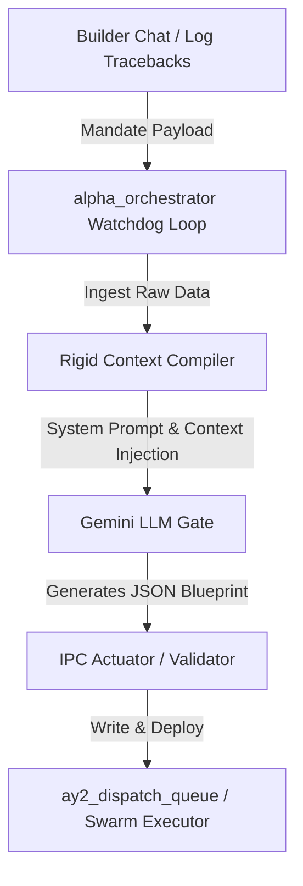

# Phase 12 Architecture Blueprint — Autonomous API Bridge

This document details the architectural specifications for the **Phase 12 Autonomous API Bridge**, orchestrating the dynamic interface between the high-level LLM reasoning layer and the physical execution environment of the **Meta App Factory (MAF)**.

---

## 1. System Topology Overview

The Phase 12 API Bridge acts as a non-blocking autonomous daemon (`alpha_orchestrator.py`) running in the background. It bridges raw mandates (from Builder Chat or active system log errors) and compiles them into highly structured, mathematically rigorous context payloads for Gemini model calls, returning validated JSON blueprints to be fed directly into the local execution queues.



---

## 2. The Watchdog Loop (`alpha_orchestrator.py`)

The orchestration engine runs a persistent `asyncio` event loop designed to act as an un-interruptible watchdog. It continuously scans designated directories and log spools for new event signals.

### 2.1 Directory and Log Tail Scan Parameters
- **Target Queue Directory:** `Master_Architect_Elite_Logic/ay2_dispatch_queue/`
- **Target Log Spools:** `Master_Architect_Elite_Logic/logs/` (monitoring tracebacks and runtime faults).
- **Scanning Mechanism:** Non-blocking asynchronous checks using `aiofiles` and `asyncio.sleep()` to prevent primary loop saturation.

### 2.2 Watchdog Event Loop Protocol
```python
import os
import asyncio
import logging
import aiofiles

logger = logging.getLogger("AlphaOrchestrator")

class AlphaWatchdog:
    def __init__(self, queue_dir: str, poll_interval: float = 1.0):
        self.queue_dir = queue_dir
        self.poll_interval = poll_interval
        self.is_running = False

    async def start(self):
        """Starts the persistent non-blocking watchdog loop."""
        self.is_running = True
        logger.info(f"Watchdog initialized on directory: {self.queue_dir}")
        asyncio.create_task(self._loop())

    async def _loop(self):
        while self.is_running:
            try:
                if os.path.exists(self.queue_dir):
                    files = [f for f in os.listdir(self.queue_dir) if f.startswith("pending_") and f.endsWith(".json")]
                    for file in files:
                        full_path = os.path.join(self.queue_dir, file)
                        logger.info(f"Dispatched watchdog event on new blueprint: {file}")
                        await self._process_blueprint(full_path)
            except Exception as e:
                logger.error(f"Watchdog Loop error: {e}")
            await asyncio.sleep(self.poll_interval)

    async def _process_blueprint(self, filepath: str):
        # Implementation details for compiling and executing blueprints
        pass
```

---

## 3. The Rigid Context Compiler

To enforce absolute conformity with the Meta App Factory development standards, the orchestrator compiles raw inputs using a strict **Rigid Context Compiler**. It wraps inputs into an structured serialization string and injects three immutable operational matrices directly into the LLM system prompts.

### 3.1 Serialization & Context Wrapper
All raw prompts sent to the generative model are wrapped in this exact serialization block, ensuring that no ad-hoc, unstructured code changes are proposed.

```python
def rigid_compile_payload(raw_mandate: str, target_file_content: str, target_file_path: str) -> str:
    """
    Structured Python compiler that compiles raw prompts and injects the
    MAF operational doctrines and system-level boundaries into Gemini payloads.
    """
    
    # ── IMMUTABLE MATRICES INJECTION ──
    sub_atomic_restitching_doctrine = (
        "=== THE SUB-ATOMIC RESTITCHING DOCTRINE (IMMUTABLE) ===\n"
        "1. All proposed edits must be returned as strict SEARCH/REPLACE blocks.\n"
        "2. The target content block to be replaced MUST exist exactly as-is in the source code.\n"
        "3. Any single edit chunk is strictly restricted to a 250-line boundary.\n"
        "4. DO NOT dump or return the entire modified file contents."
    )
    
    verification_matrix = (
        "=== THE E2E PLAYWRIGHT VERIFICATION MATRIX (IMMUTABLE) ===\n"
        "1. All architectural changes, proxy updates, and endpoints must be validated.\n"
        "2. Verification MUST utilize a headless Playwright end-to-end spec file (.spec.ts).\n"
        "3. Asserting success using raw screenshots or DOM/UI presence logs is permanently forbidden.\n"
        "4. The spec must perform strict HTTP status and response schema validations."
    )
    
    io_serialization_envelope = (
        "=== THE I/O SERIALIZATION ENVELOPE MATRIX (IMMUTABLE) ===\n"
        "1. All generated API payloads must enforce a strict pagination boundary.\n"
        "2. Responses returning collections of records must strictly serialize as:\n"
        "   {\"items\": [...], \"total\": int, \"limit\": int, \"offset\": int}\n"
        "3. Payloads must strictly comply with the 'Infrastructure_Blueprint.json' schema."
    )
    
    prompt_payload = f"""
ROLE: You are the Antigravity Swarm Architect (AY2). You are tasked with executing a sub-atomic mutation.

{sub_atomic_restitching_doctrine}

{verification_matrix}

{io_serialization_envelope}

---
TARGET FILE: {target_file_path}
---
SOURCE CODE:
{target_file_content}
---
COMMAND MANDATE:
{raw_mandate}
"""
    return prompt_payload
```

---

## 4. IPC Actuation Protocol

Once the generative model returns the evaluated JSON blueprint containing the verified sub-atomic diff blocks and Playwright verification spec, the `alpha_orchestrator.py` triggers the **IPC Actuation Protocol** to execute changes natively.

### 4.1 Execution Handoff Sequence

```text
  [Gemini Response]
          │
          ▼
┌──────────────────┐
│  Json Validator  │ ──(Fails)──► [Quarantine & Raise Telemetry Alert]
└──────────────────┘
          │ (Passes)
          ▼
┌─────────────────────────────┐
│  Atomic Disk Swap (Splicer)  │
└─────────────────────────────┘
          │
          ▼
┌─────────────────────────────────┐
│ Run Playwright Verification Spec│ ──(Fails)──► [Rollback Changes & Telemetry Alert]
└─────────────────────────────────┘
          │ (Passes)
          ▼
┌────────────────────────────────────────────────────────┐
│ Push Success Event to War Room & Archive Dispatch JSON │
└────────────────────────────────────────────────────────┘
```

1. **JSON Validation:** Ingests the API response and asserts strict structural compliance against the `Infrastructure_Blueprint.json` schema. Any parsing failures quarantine the payload and trigger a telemetry alarm.
2. **Atomic Disk Swap (AST Splice):** Executes the compiled SEARCH/REPLACE diff chunks directly onto the target files on the local filesystem.
3. **Headless Execution Handoff:** Dynamically spawns a non-blocking process executing `npx.cmd playwright test <generated_spec>.spec.ts` under the correct package context.
4. **Handoff Decision Gate:**
   - **On Success:** Staged changes are finalized, a success event is broadcast to the War Room SSE feed, and the blueprint is moved to `ay2_dispatch_queue/archived_...`.
   - **On Failure:** The active change is immediately rolled back using local Git restores, a high-priority crash warning is logged to `central_error.log`, and the blueprint is isolated as `ay2_dispatch_queue/broken_...`.
